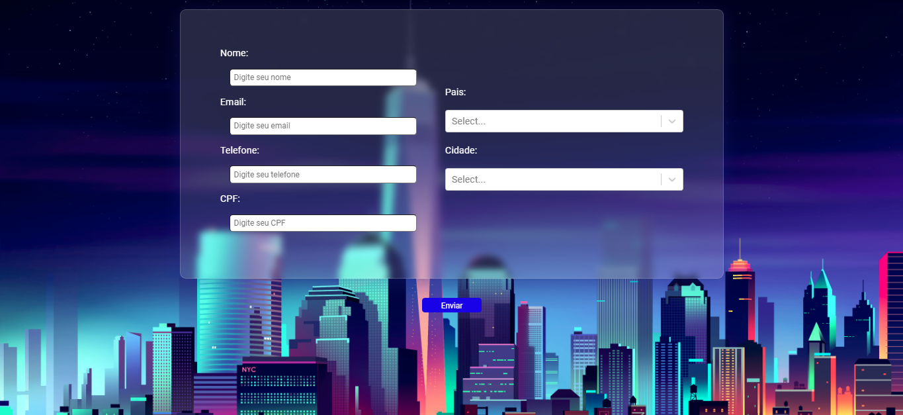

<h1 align="center"> Desafio02 - ALLY React </h1> 

Desafio 02 proposto pela empresa ALLY, como complemento do processo seletivo de estágio.

  

## 🚀 Tecnologias

Tecnologias utilizadas no Desafio 02 | ALLY :

- ReactJS
- CSS
- JSON
- [API Paises](https://amazon-api.sellead.com/country)
- [API Cidades](https://amazon-api.sellead.com/city)
- [Axios](https://www.npmjs.com/package/axios)
- [React-Select](https://react-select.com/home)
- [React-Text-Mask](https://www.npmjs.com/package/react-text-mask)

## 💻 Projeto

O "Desafio02-ALLY-React" é um projeto em React JS proposto pela empresa ALLY como teste complementar do seu processo seletivo de estágio.

